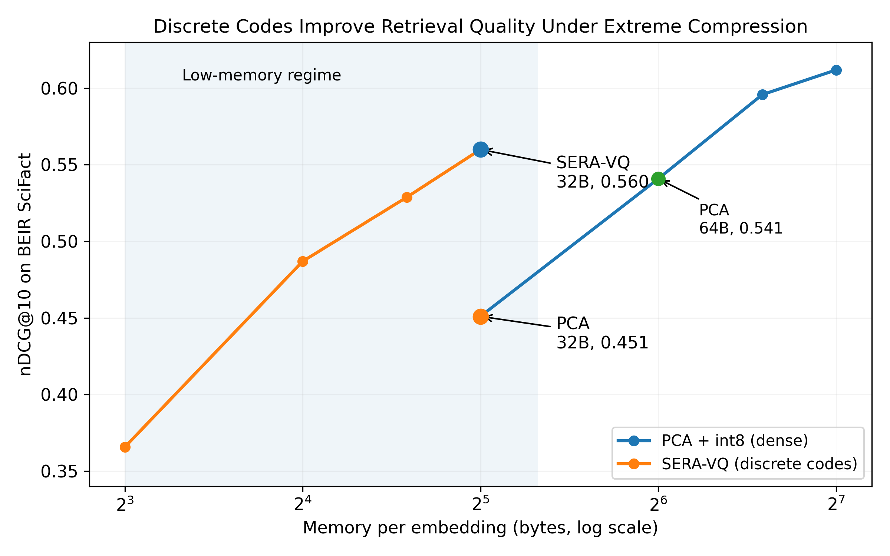

# SERA-VQ: SERA-VQ (Structured Embedding Representation via Residual Approximation and Vector Quantization) 
A simple pipeline that compresses dense embeddings into compact discrete codes.

It shows that under tight memory constraints, discrete representations can outperform traditional dense embeddings in retrieval tasks.

Dense embeddings are not always the best representation.

Modern embedding systems assume dense floating-point vectors are the best representation for semantic similarity.

This repository shows they are not.

We demonstrate that under tight memory constraints, discrete vector codes outperform dense PCA-compressed embeddings in retrieval tasks.

---

## Main Result



---

## Key Result (BEIR / SciFact, nDCG@10)

| Method     | Bytes per embedding | nDCG@10 |
| ---------- | ------------------- | ------- |
| PCA + int8 | 32                  | 0.451   |
| SERA-VQ    | 32                  | 0.560   |

At the same memory budget, SERA-VQ achieves +24% relative improvement in ranking quality.

---

## Key Insight

There exists a low-memory regime where dense embeddings are suboptimal.

- High memory → PCA is strong
- Low memory (≤32 bytes) → discrete codes outperform

---

## Method Overview

SERA-VQ compresses embeddings using:

1. PCA for dimensionality reduction
2. Residual Vector Quantization (RVQ)
3. Representation as short sequences of discrete codes

Each embedding becomes:

`[c1, c2, c3, ..., cn]`

instead of a dense floating-point vector.

This allows extreme compression:

- 1536 bytes (float32) → 8–32 bytes
- while preserving semantic structure

---

## Repo Structure

```
sera-vq/
├── experiments/
├── plots/
├── figures/
└── results/
```

---

## How to Run

```bash
pip install -r requirements.txt
python experiments/sera_beir_scifact_experiment.py
```

---

## Experiments

- STS-B → semantic similarity
- BEIR (SciFact) → real retrieval evaluation

---

## Summary

Discrete representations outperform dense embeddings under extreme compression.

---

## Paper

Preprint coming soon on arXiv.

## Status

- [x] STS-B experiments
- [x] BEIR SciFact results
- [ ] Additional datasets (future work)
